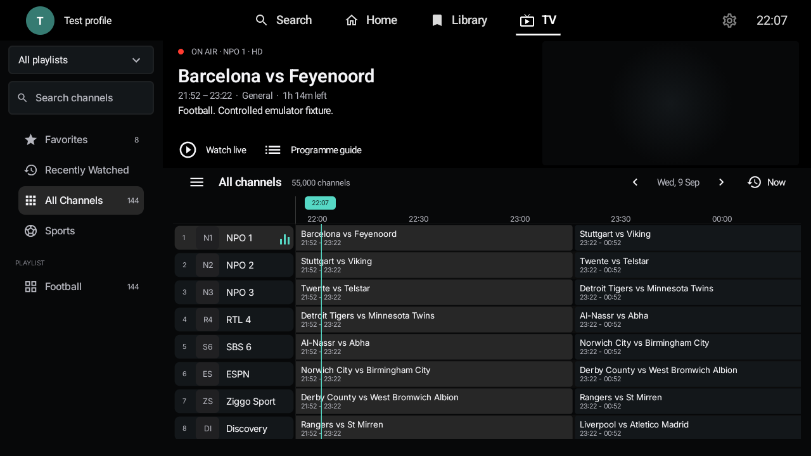
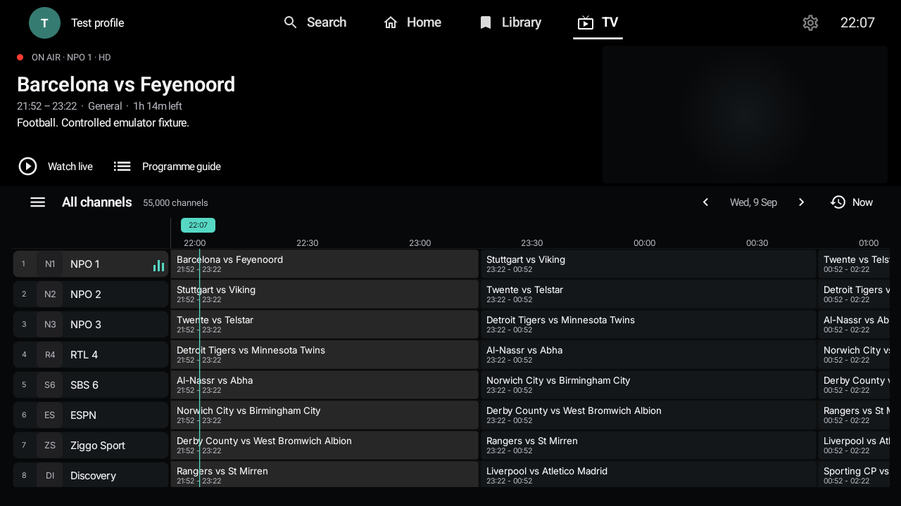
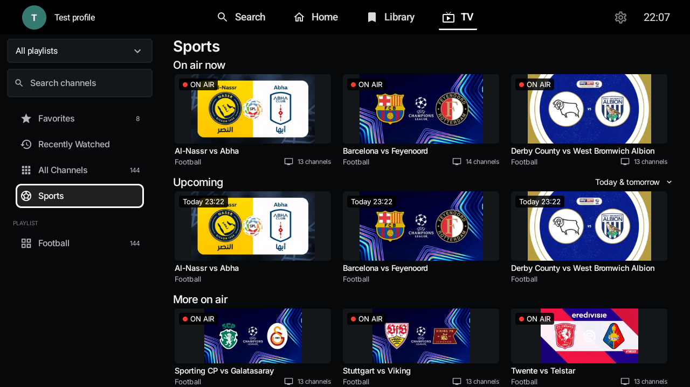
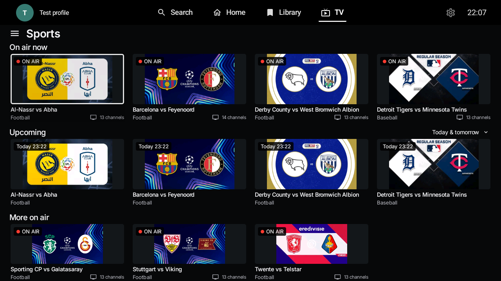
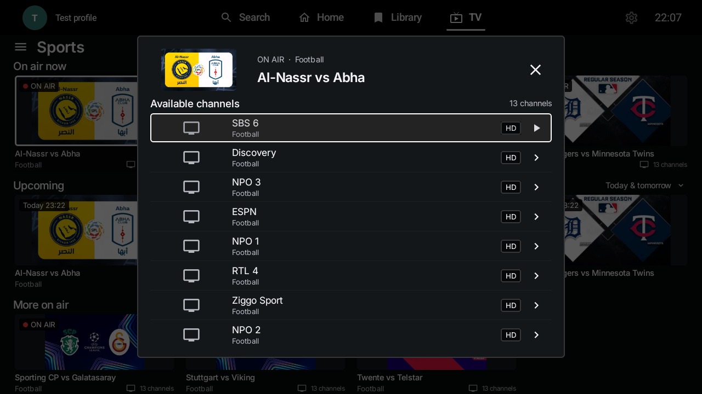
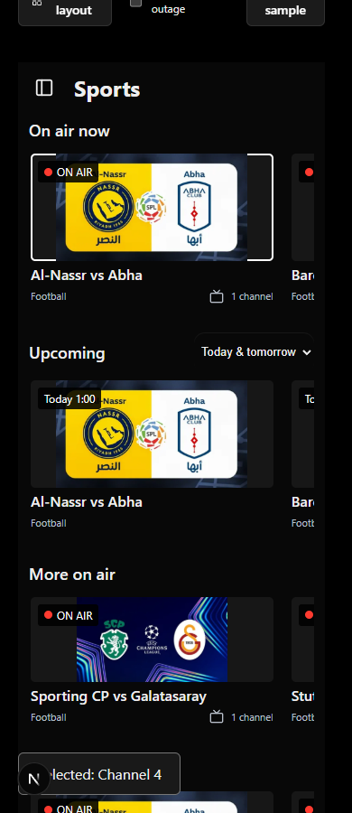
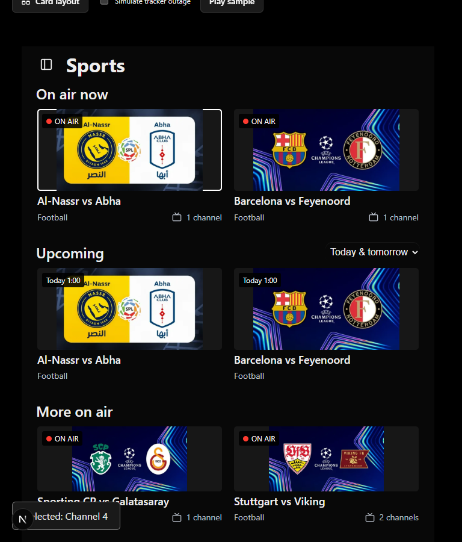

# TV guide and Sports overhaul: review build

Status: **draft, not a release candidate**. Base: `0c9f4caf1`.

This implements the guide/Sports workspace and a second reference-comparison pass on Android and web. It does
not claim that every acceptance gate in the larger overhaul plan is complete.
Do not merge until the remaining gates below have been addressed.

## Implemented

- Charcoal guide surfaces, neutral selection, white focus and turquoise time markers.
- Programme information on the left, existing Android mini-player anchored on the right.
  The web guide now docks its existing video element into the same position; expanding
  and collapsing it retains the decoder/connection. Mobile also keeps the video visible.
- Current profile avatar and, on wide TV layouts, its name in the top-left corner.
- A 200 ms reversible category drawer that moves the viewport without measuring
  every EPG cell on every animation frame. Guide/Sports scroll state is retained
  separately on the wide Android workspace.
- Sports below All Channels, not in the global navigation. User categories remain.
- On-air, upcoming today/tomorrow, more on-air, and ten separate sport rows.
  Football/American football and boxing/MMA remain distinct.
- Local timezone and device clock formatting. Ended, invalid and explicitly
  labelled replay/highlight entries are excluded.
- Responsive, whole-card desktop tracks with wide event banners from compatible installed sports addons. Match-specific
  backgrounds replace generic ball/glove photos; unavailable artwork retains a readable
  event identity instead of a broken image or unrelated picture.
- Complete-image fitting instead of cropping club crests and embedded lettering. This
  can leave side margins when a provider supplies 16:9 artwork for a wider card.
- Today, Tomorrow and combined Upcoming filters using local calendar boundaries,
  including daylight-saving changes. An empty selected day keeps its filter reachable.
- Readable sidebar counts, corrected local Inter variable-font weights, balanced TV
  navigation, guide gutters, and separate timeline-label/current-time-marker tracks.
- A dimmed event picker with first-playable-source focus and origin-card focus return.
  Unknown language is no longer presented as English. Known quality/language remain visible.
- Web provider/search controls inside the sidebar, compact guide controls, channel
  numbers/favorite indicators, and programme time captions. Existing management and refresh
  controls remain available, without a second large Live TV heading above the workspace.
- Event channel picker preserving provider-specific source choices and known
  quality. Upcoming channels are shown as scheduled, not playable live events.
- Hidden/locked sources excluded; web reads Android's existing cloud lock fields
  without adding a new lock-writing format.
- Web Sports indexing in a worker; Android scans lightweight channel labels and
  reads the existing local guide index in batches. No stream probes on card focus
  and no new provider network request loop.
- Existing guide paging, provider request limits and playback resolver
  are retained. No provider credentials, full EPG or new large data enter cloud sync.
- XMLTV programme artwork/category metadata is retained in both parsers and in the
  Android guide index. The v7-to-v8 migration retains existing guide/catch-up data.
- Cosmetic title differences, reversed opponents and small broadcast padding differences
  can match across channels, while each source retains its own start/end time.
  Cancelled/postponed/abandoned programme titles are excluded.
- Android discovers sports on general channels with cached EPG, not only currently
  visible channels. Classification is bounded/cached across variants; aggregation
  avoids repeatedly copying growing source lists. No extra provider requests are added.
- The native touch category rail can collapse/reopen. Android pauses the hidden
  mini-player while browsing Sports; web stops the player when its guide slot disappears.

## Critical comparison with the references

The implementation is **not pixel-identical**, especially the artwork. The references
use curated, composed match graphics with consistent league/club branding. Addons supply
mixed aspect ratios, quality and art direction; CSS or Compose cannot turn these into
the exact reference assets. The change preserves the whole supplied image rather than
silently cutting off logos. Missing event artwork still uses a readable title fallback.

| Reference gap | This pass |
| --- | --- |
| Uneven card widths, partial desktop cards | Container/viewport-based tracks; three open and four closed on wide layouts |
| Cropped crests and text | Complete-image fitting on cards and picker |
| Weak hierarchy and tiny sidebar counts | Local variable-font weights, larger counts, brighter and centered TV navigation |
| Missing Upcoming date control | Today / Tomorrow / combined filter, local-day and DST tests |
| Picker background/focus too weak | Explicit Android window dimming; browser focus waits for actual virtual rows |
| Crowded guide time marker | Separate label track; date follows the displayed window |
| Bulky web header unrelated to reference | Provider/search moved into sidebar; compact workspace commands |
| Invalid screenshot evidence | Capture now rejects black windows; the previously blank guide-open image is replaced |

Still missing from the reference: reliably complete artwork coverage, verified
live/trending event data and reliable mapping of abbreviated/localized event names.
Competition labels are only extracted when explicitly present in programme text.
No popularity, channel availability or official-artwork claims
are invented to make the screenshots look fuller. Fixtures intentionally retain synthetic
schedules, inactive video and missing channel-logo fallback states.

Variable-font configuration follows the Android O+ API with an older-platform fallback:
[Android font documentation](https://developer.android.com/develop/ui/compose/text/fonts?hl=en).

## What the Sports data means

This pass uses **the user's EPG**, not a live event/popularity service. "On air"
means the provider schedule overlaps the current time. It does not certify a live
sporting fixture rather than an unlabelled replay. Matching requires a compatible
normalized identity and sport, start times within 15 minutes and substantial schedule
overlap. Each channel's actual interval still controls availability. Localized or
abbreviated names may remain separate. General channels with cached schedules are
included, but channels with no EPG cannot be discovered this way.

There are deliberately no invented viewer counts, "trending" claims, default
third-party streams or hardcoded credentials. Artwork is addon-provided, not a claim
of official rights clearance. Only exact normalized event titles with compatible
sports receive that artwork. Addon status and times do not overwrite EPG facts.
The artwork request budget is at most two enabled installed addons, three catalogs
each, five seconds per catalog, with ten-minute caching and shared in-flight work.
No IPTV stream is probed for an image. UTC-stamped posters and channel-recording
covers are rejected. Devices render schedule labels in their local time separately.

## Verification (2026-09-09/10)

Android testing uses an isolated `com.arvio.tv.overhaul` debug package on the
Android 31 Google TV x86 emulator, 1280x720, 2 GB RAM, software GPU. The physical
TV was not used. These are not release-device performance measurements.

| Check | Observed result |
| --- | --- |
| Android build | Sideload debug + instrumentation APK compile/package succeeded |
| Focused Android JVM suite | 66 passed, 0 failed |
| Android instrumentation | 13 passed, including six decoded remote event banners, five-state captures, drawer/picker focus, first-click favorites, sustained/rapid channel navigation, bounded cells, 50k storage regression and metadata migration/roundtrip |
| Web sports/artwork rules | 15 passed, 0 failed, including local-day boundaries, cache/request bounds and wrong-match rejection |
| Web TypeScript | No errors |
| Browser checks | Desktop 1672px, tablet 768px, phone 390px passed; date filter, four complete desktop cards, uncropped artwork, first-source focus/origin return, decoded CC0 mini-player playback and retained video identity across expand/collapse, 16:9 preview bounds, no overflow or uncaught errors |
| Supplied provider import | 54,502 channels, 833 groups, 240 in-memory startup rows |
| Fresh import | Latest: first channels callback 11,846 ms; complete channel import 28,901 ms |
| Provider short guide | 0 matches for 2 sampled channels |
| Full XMLTV fallback | Latest: 69,044 ms; 8,955 indexed channel identities and 313,855 programmes; both sampled channels matched |
| Cache reopening | Latest in-process audit: channels in 35 ms, two cached EPG entries in 70 ms; no list redownload. Earlier separate cache reopen measured 300/358 ms |
| Real Sports scan | Latest complete scan: 30,880 ms (5,833 ms database, 24,357 ms matching), down from 67,651 ms before the allocation/pattern changes. 8,848 cached channel IDs, 295,884 programme entries, 2,615 grouped events, 114 scheduled on air |
| Real artwork coverage | Provider programme art: 0. Installed addon returned 18 artwork entries; 0 safely matched the tested EPG events. Curated fixture banner coverage is not real-list coverage |
| Stale cloud apply regression | Ten identical config applies plus a favorites-only apply retained all 54,502 channels |
| Earlier real provider playback smoke test | ESPN mini-player rendered video; 87.3% of sampled interior pixels changed between captures. This preceded the latest scan changes |

The cache timings measure repository readiness, not navigation-to-rendered-pixel
P95. The complete Sports scan is still not instant; first partial rows can appear
before it finishes. A still screenshot is not playback proof. The video pixel check is a smoke
test, not a decoder, rebuffer or long-soak guarantee. Fresh import does **not** meet
the five-second objective. EPG coverage is not 100% of the provider's channels.

The automated five-state captures use controlled programme/channel fixtures and
an inactive mini-player. Sports artwork comes from a captured public addon catalog;
the fixture times/channels are synthetic and do not verify actual broadcasts.
The guide fixture has a 55k logical count and a bounded
144-row window; full provider reachability is checked separately.

## Screenshots

### Guide, drawer open

### Guide, drawer closed

### Sports, drawer open

### Sports, drawer closed

### Event channel picker

### Web, phone and tablet

## Remaining merge gates

1. Complete installed-addon event metadata/stream adapters and explicit event status/freshness
   beyond provider text. Improve localized/abbreviated identity mapping without attaching
   the wrong match image. Audit artwork
   permissions separately from code; generic fallback photos are no longer used
   in event cards, but an addon without a matching background still has no event image.
2. Match the reference spacing and all five states more closely. Verify the new
   native phone drawer on actual phone/tablet configurations and localize new Sports strings.
3. Measure repeated optimized-build input/render percentiles with moving video,
   including a 2 GB physical device when authorized, 100k stress, animation
   interruptions and a 30-minute soak. The renderer comparison and baseline
   profile extension in the larger plan have not been completed here.
4. Finish cross-device cloud/PIN, native phone/tablet rotation, RTL, large text,
   TalkBack/VoiceOver and Safari checks. Existing hidden/locked groups must never
   be bypassed through event lookup.
5. Further improve first useful Sports data latency and cached UI pixel timing.
   Existing event order is retained on refresh, but changed IDs/timestamps need
   stronger focused-event reconciliation.
6. Same-certificate release/update testing after approval. No version bump, release
   publication, production web deployment or merge is part of this draft. A user-requested
   same-package TV preview update is being built separately from the isolated emulator APK.

## Reproducing local checks

- Android JVM: `:app:testSideloadDebugUnitTest` filtered to `*SportsGuideTest`,
  `*LiveTv*Test` and `*EpgGrid*Test`.
- Instrumentation: `TvOverhaulDeviceTest`, `GuideRenderingDeviceTest`,
  `GuideFavoriteActionDeviceTest`, `IptvStoreDeviceTest`, `GuideRenderingBenchmark`.
- Provider audits are explicitly opt-in through instrumentation arguments on an
  isolated test package. Never put the playlist URL in source, screenshots or CI.
- Web: `npx tsc --noEmit --incremental false`,
  `node --test tests/sports-guide.test.cjs tests/sports-artwork.test.cjs`.
- Browser: start Next dev on port 3109 with `ARVIO_UI_FIXTURES=true` and
  `ARVIO_BUILD_DIR=.next-overhaul`, then run `node tests/tv-overhaul-browser.cjs`
  in an environment with Playwright and Chrome installed. The fixture route is
  development-only. The browser test mocks catalog metadata and allows only the
  fixture's image CDN and a CC0 MP4 sample externally to verify decoding. Neither is
  evidence of actual provider event availability.
